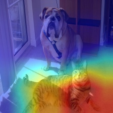

# A simple implementation for feature visualization 特征可视化

## Foreword

The code mainly referred to [https://github.com/jacobgil/pytorch-grad-cam]().I did a simple reproduction  for better understanding and using.

## Demo

| Original            | GradCAM                                   |
| ------------------- | ----------------------------------------- |
|  |  |

## Usage

In general, you only need to make the following changes:

1.target_model:Currently only PyTorch's officially provided CNN model for classification is supported. Transformer-based model and models used for downstream tasks (e.g. object detection, segmentation) will be gradually updated in the future.

2.target_layer: Select the single layer or the combination of the layers (usually the last layer but it can be any layer you want) which you want to visualize features.

**It should be a list.**

eg:

    ResNet-18 and 50: model.layer4

    VGG, DenseNet121,MobileNet: model.features[-1]

3.img_path:The path of input images.

4.target_category:Choose the category which is used to compute the gradient.
